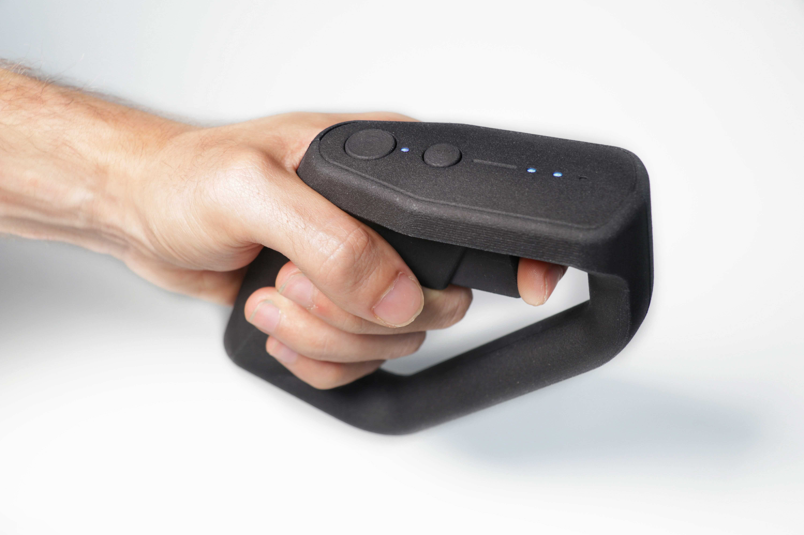
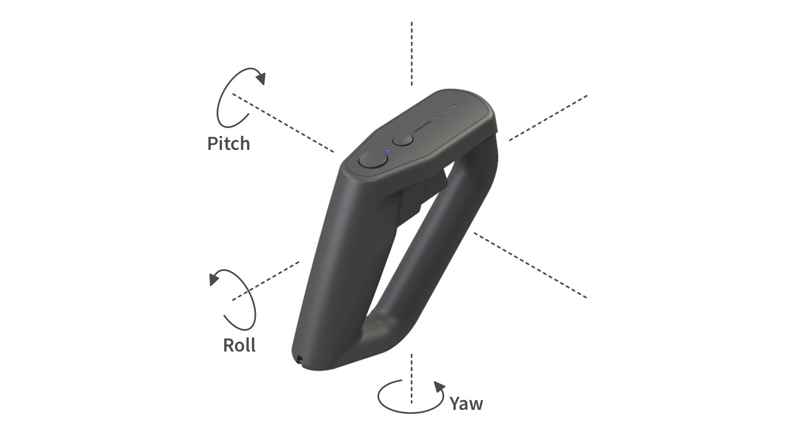

# swoop

    
    
    
    

## What is swoop🛫?

With swoop, you can fly remote controlled aircraft with the motion of your hand. It's especially fun when flying FPV because the motion of your remote precisely maps to the aircraft.

## Open Source Hardware..?

This project is fully open source. But one might ask, how can it be open source if "source code" doesn't exist for hardware? At least, not in the same way that it exists in software with languages like C, Python or Rust?
Well, that's why we are designing this remote with [atopile](https://github.com/atopile/atopile), a new language and compiler for electronics.
With atopile, we can version control the hardware alongside the firmware, make issues and pull requests, run continuous integration to generate manufacturing files automatically and reuse section of our design. This is true Open Source Hardware!

## Here is how it works:

The three rotation axis, yaw, pitch, roll of the remote each control the same channel on your aircraft. If you tilt your remote to a certain angle, your aircraft will rotate in that same direction with a certain rotational speed. That's what makes this controller so intuitive to use!
To start using the remote, simply double click the arming button (the larger button). This will zero the controller to the current position and start streaming the control outputs to the receiver.

To control the throttle, which is your aircraft's motor power, simply press the trigger. Inside the controller, a hall sensor precisely keeps track of the trigger position. This makes for a total of four control inputs with yaw, pitch, roll and throttle.

The smaller button on the remote let's you switch the flight mode. Pretty handy to tweak how your aircraft reacts to your control inputs!

Lastly, the remote has an integrated transceiver from the popular open source ExpressLRS project, which makes it compatible with any of their receivers!

## Feature list

Here is what we are planning for this controller:

- Yaw, pitch and roll control angles from the motion of your hand
- Throttle control through the trigger
- Arming button (sets zero position and turn control inputs on/off)
- Flight mode button
- Embedded ExpressLRS transceiver
- Rechargeable over USB-C

## Documentation & Status

We will share documentation once we've made more progress on the project development. For current status, checkout the [product page](https://atopile.io/swoop/).

## Join us!

### Discord

If you are curious about the project, join us on the [atopile discord server](https://discord.gg/nr5V3QRUd3).

### Contributing

If you would like to contribute on atopile, here is what you will need:

For electronics:
- [atopile](https://atopile.io): here is a guide on how to install it: https://atopile.io/getting-started/
- [ExpressLRS](https://www.expresslrs.org): ELRS is an open source long range communication protocol for remote controlled aircraft. If you would like to test the remote, having compatible hardware will help!

For firmware:
- [PlatformIO](https://platformio.org): Cross platform firmware development toolchain
- [CRSF for Arduino](https://github.com/ZZ-Cat/CRSFforArduino): Implementation of the CRSF protocol for arduino. We'll be running this library to stream data from the controller microcontroller to the EzpressLRS module
- [ExpressLRS](https://www.expresslrs.org): ELRS is an open source long range communication protocol for remote controlled aircraft. Their firmware will be flashed on the embedded ESP32S2 module within the controller.

## Happy Flying!

