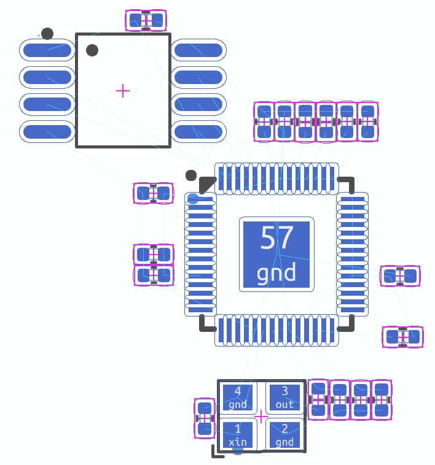
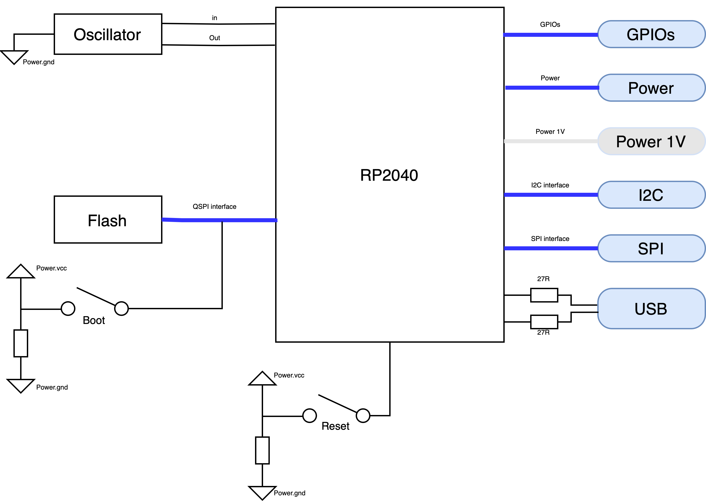

# RP2040

## Installation
Run in the terminal:

```ato install rp2040```

Add to your ato project:

```import RP2040Kit from "rp2040/rp2040.ato"```

[LINK](https://gitlab.atopile.io/packages/RP2040) to the repo.

## Overview

This package should include all the basics needed to layout an RP2040 microcontroller.

## Features

- **Power Interface:** 3.3v voltage input
- **SPI Interface**
- **I2C Interface** Inter-Integrated Circuit interface for connecting low-speed peripherals.
- **USB 2.0 Interface** Handy to program the rp2040. Hook this up to an usb-c. There is a usb-c in a module as well.
- **GPIO Pins:** General Purpose Input/Output pins for digital input/output functionality.
- **Analog Inputs:** Four analog inputs (A0-A3) for reading analog signals.

## Getting Started

1. **Powering the Module:** Requires a 3.3V supply connected to the power interface.
2. **Connecting Interfaces:** Utilize SPI, I2C, and USB interfaces as per your project requirements.
3. **Utilizing GPIO and Analog Inputs:** Connect your sensors or peripherals to the GPIO or analog inputs as needed.
4. **Programming:** Program the module using your preferred development environment compatible with the RP2040.

## Example Layout



### Layout notes
- Caps should be close to the micro on the 3V3 an 1V1 rails
- 12MHz crystal should be close to micro
- USB series resistors should be close to micro
- Maybe just put everything close to the micro...

## Documentation & Resources

- [Official RP2040 Datasheet](https://datasheets.raspberrypi.com/rp2040/hardware-design-with-rp2040.pdf)

Here is roughly what's going on in the module:



What you have to deal with:

*Courstesy of John Mcmaster*

## Contributing

Contribute to this package using pull requests.

## License

This RP2040 module documentation is provided under the [MIT License](https://opensource.org/license/mit/).

## Contact

For further inquiries or support, please contact us at [narayan@atopile.io](mailto:narayan@atopile.io).
